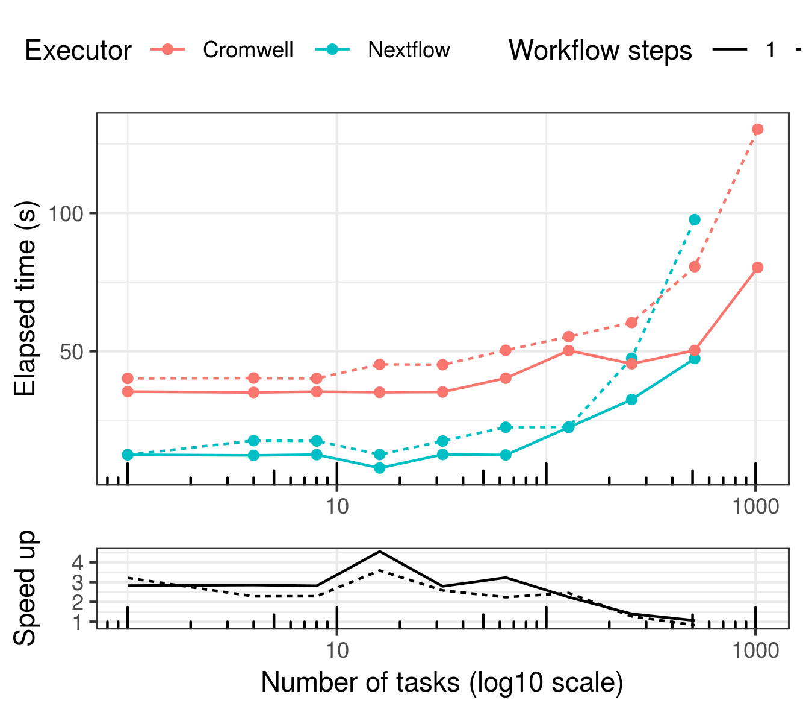
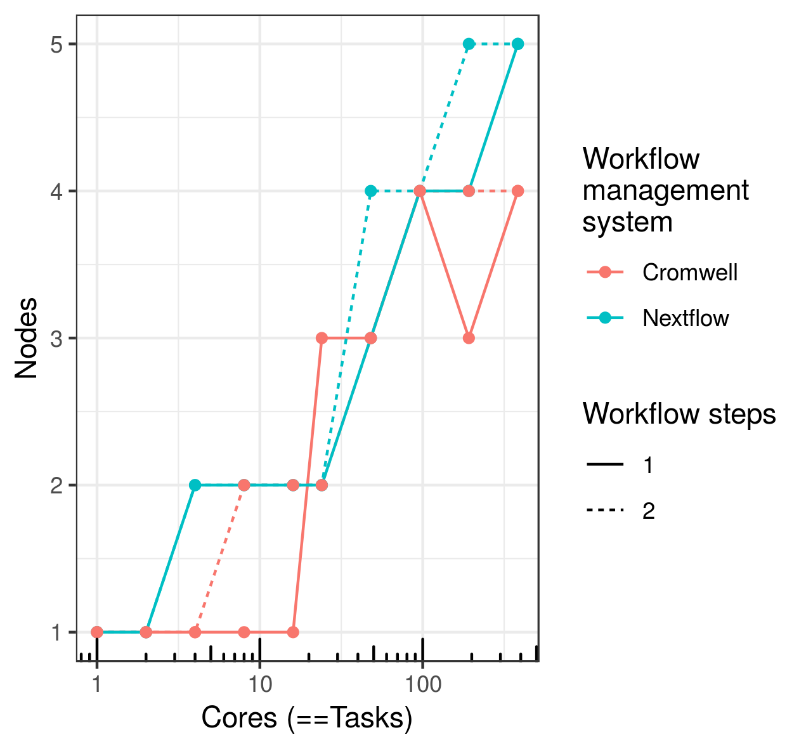
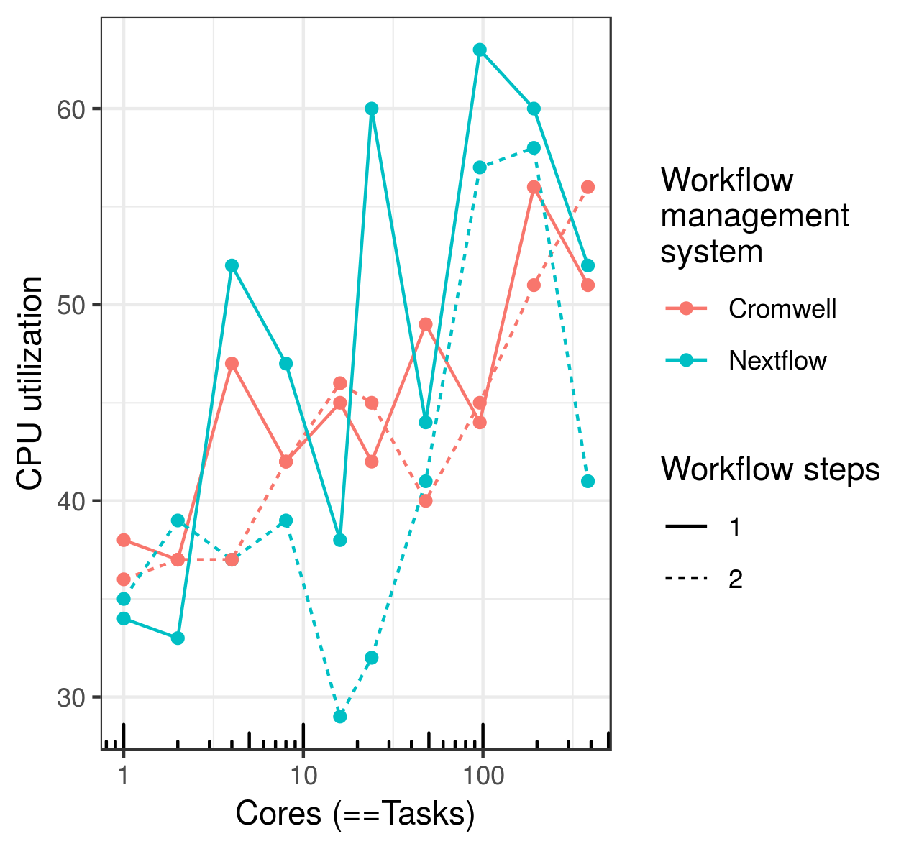

# wfms-scalability

This repo contains the source code, raw results and figures of accompanying our manuscript "Requirements-driven design considerations for workflow management systems used in production genomics research and the clinic". Key files in this repo are organized as follows:

.
├── cluster.setup.md # Instruction for setting up an AWS slurm cluster 
├── pcluster.config  # Cluster configurations 
├── prep.cluster.sh  # Preparing AWS cluster for testing 

├── results.<biocluster/AWS> # Scalability testing results on Biocluster/AWS. Files are organized per Engine+language as:
│   └── <cromwell.wdl/cromwell.cwl/nf>
│       ├── hosts
│       │   ├── host1_tasks1024.txt
│       │   └── host2_tasks96.txt
│       ├── logs-wdl
│       │   ├── bioinfoScaling_processes-1_host.txt
│       │   ├── bioinfoScaling_processes-2_host.txt
│       │   ├── jsons
│       │   │   ├── cromwell.config.1
│       │   │   ├── host_process_workflow.
│       │   │   └── host_process_workflow..8.json
│       │   └── progress_bioinfoScaling.txt
│       └── summarize_hosts_nodes.txt
└── src
    ├── analysis # R codes for plotting
    ├── cwl
    │   ├── backend.conf
    │   ├── bioinfoScaling.cromwell.sh
    │   ├── bioinfoScaling.cromwell.sh.log
    │   ├── bioinfoScaling.toil.sh
    │   ├── cores.txt
    │   ├── dag_cwl_rabix_hosts_workflow.png
    │   ├── host.hostname.tool.cwl
    │   ├── host.hostname.tool.yml
    │   ├── host_process.cwl
    │   ├── host_process_workflow.yml.tmpl
    │   ├── host.serialize.tool.cwl
    │   ├── host.serialize.tool.yml
    │   ├── host.sort.tool.cwl
    │   ├── host.sort.tool.yml
    │   ├── host.sort.workflow.cwl
    │   ├── host_workflow.cwl
    │   ├── host.workflow.yml
    │   ├── README.md
    │   └── workflow.options.json
    ├── nf
    │   ├── bioinfoScaling.sh
    │   ├── bioinfoScaling.sh.log
    │   ├── cores.txt
    │   ├── cs_scaling_archive
    │   │   ├── sleep_process.nf
    │   │   ├── sleep_workflow.nf
    │   │   ├── strongScaling.sh
    │   │   └── weakScaling.sh
    │   ├── dag_nf_hosts_workflow.dot
    │   ├── dag_nf_hosts_workflow.html
    │   ├── dag_nf_hosts_workflow.png
    │   ├── host_process.nf
    │   ├── host_workflow.nf
    │   ├── nextflow.config
    │   ├── ntasks.txt
    │   ├── pcluster.config
    │   ├── README.md
    │   └── tst-nf.sh.nohup
    └── wdl
        ├── AST.out
        ├── backend.conf
        ├── bioinfoScaling.cromwell.sh
        ├── bioinfoScaling.toil.sh
        ├── bioinfoScaling.toil.sh.nohup
        ├── cores.txt
        ├── cs_scaling_archive
        │   ├── sleep_process.wdl
        │   ├── sleep_process_workflow.json
        │   ├── sleep_process_workflow.json.tmpl
        │   ├── sleep_workflow.wdl
        │   ├── strongScaling.sh
        │   └── weakScaling.sh
        ├── dag_wdl_hosts_workflow_detailed.dot
        ├── dag_wdl_hosts_workflow_detailed.png
        ├── dag_wdl_hosts_workflow.dot
        ├── dag_wdl_womtool_hosts_workflow.png
        ├── host_process.wdl
        ├── host_process_workflow.json.tmpl
        ├── host_workflow.wdl
        ├── mappings.out
        ├── ntasks.txt
        ├── README.md
        ├── results.toil
        │   ├── hosts
        │   │   ├── toilwdl_compiled.py
        │   │   └── toilwdl_compiled.pyc
        │   └── logs-wdl
        │       ├── bioinfoScaling_processes-1_host.txt
        │       ├── jsons
        │       │   ├── host_process_workflow
        │       │   └── host_process_workflow.1.json
        │       └── progress_bioinfoScaling.txt
        ├── scripts_bioscaling_manual
        │   ├── bioinfoScaling.sh
        │   ├── bioinfoScaling.sh.nohup
        │   ├── host_process.wdl
        │   ├── notes
        │   └── summarize_hosts_nodes.sh
        ├── workflow.options.json
        └── working_wdls_toils
            ├── host_process.toil.version.wdl
            ├── host_process_workflow.toil.version.json
            ├── log.txt
            ├── toilwdl_compiled.py
            └── toilwdl_compiled.pyc

## Set up

## HPC comparison

The figures shown here are from running those scalability tests on [biocluster](https://biocluster2.igb.illinois.edu/), the HPC cluster of the Carl R. Woese Institute for Genomic Biology at the University of Illinois at Urbana-Champaign.

Please find the corresponding raw data in the folder [results.biocluster](). Similarly, the data for Figure [xxx]() of the manuscript corresponding to tests done on AWS is available in [results.aws](). The analysis code to produce these figures is in [src/analysis]()

