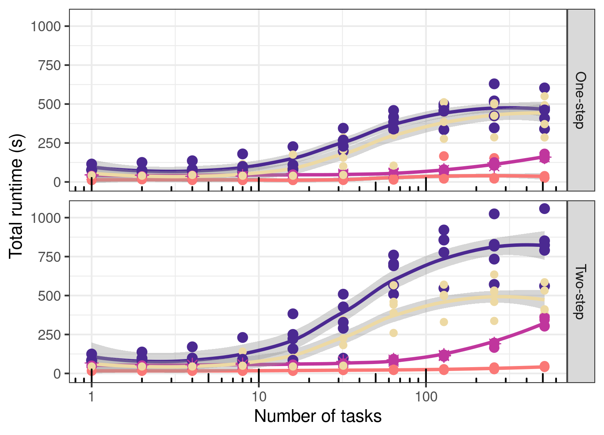
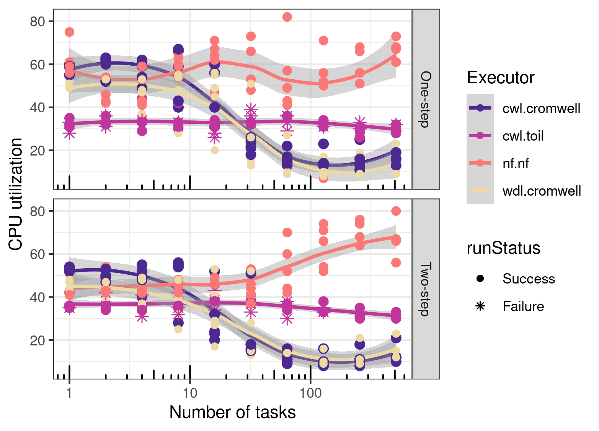
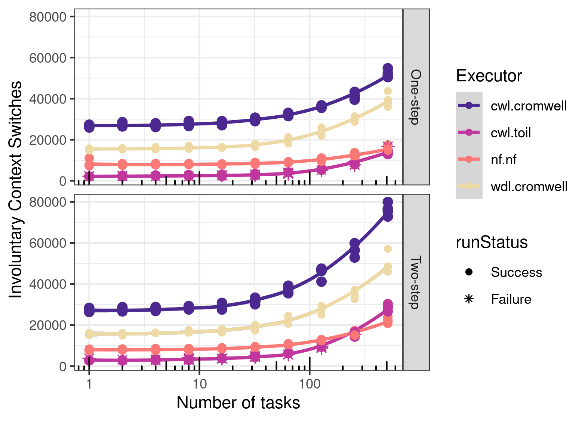
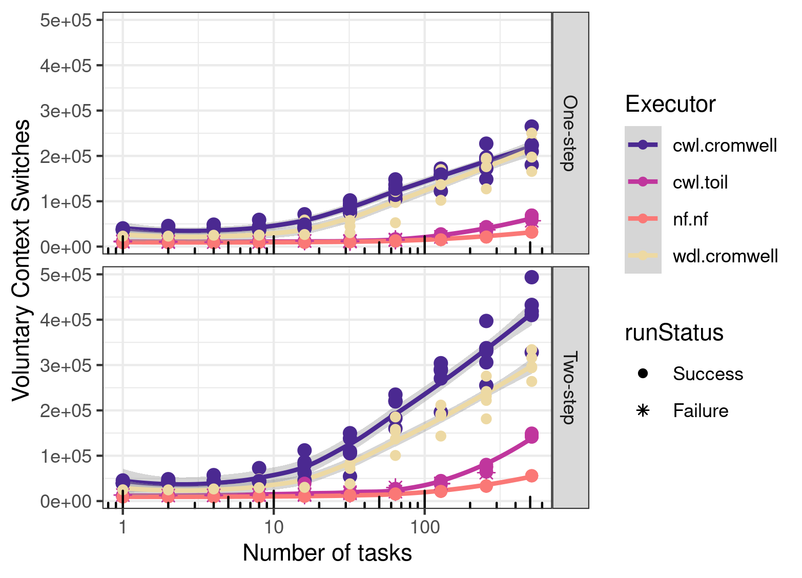

# wfms-scalability

This repo contains the source code, raw results and figures accompanying our manuscript "Requirements-driven design considerations for workflow management systems used in production genomics research and the clinic". Key files in this repo are organized as follows:

```
.
├── cluster.setup.md # Instruction for setting up an AWS slurm cluster 
├── pcluster.config  # AWS Cluster configurations 
├── results/<biocluster/AWS>.20<19/21> # Scalability testing results on Biocluster/AWS. Files are organized per Engine+language as:
│   └── <cromwell.wdl/cromwell.cwl/toil.cwl/nf> 
│       ├── hosts 
│       │   ├── host1_tasks<1024>.txt # hostnames of running the 1 step workflow of <1024> tasks
│       │   └── host2_tasks<96>.txt   # hostnames of running the 2 step workflow of <96>   tasks
│       ├── logs-wdl
│       │   ├── bioinfoScaling_processes-1_host.txt # Timing and resources of the 1 step workflow
│       │   ├── bioinfoScaling_processes-2_host.txt # Timing and resources of the 2 step workflow
│       │   ├── <jsons/yml> # configuration files for cromwell runs
│       │   └── progress_bioinfoScaling.txt # progress log
│       └── summarize_hosts_nodes.txt # Number of nodes and tasks for the 1 and 2 steps workflow runs
└── src
    ├── analysis # R codes for plotting
    └── <cwl/nf/wdl>
       ├── bioinfoScaling<.cromwell>.sh # Main script for launching tests <via cromwell/toil/..>
       ├── host_process.<cwl/nf/wdl>         # 1 step workflow code
       ├── host_workflow.<cwl/nf/wdl>        # 2 step workflow code
       ├── host_process_workflow.<yml/json>.tmpl  #yml/json inputs template 
       ├── host.<hostname>.tool.cwl   # cwl CommandLineTools files
       ├── host.<hostname>.tool.yml   # inputs for testing cwl tools 
       ├── dag_<cwl_rabix_hosts_workflow>.png  # DAG showing the 2 step workflow
       ├── workflow.options.json      # cromwell options file
       ├── backend.conf               # cromwell backend file
       ├── nextflow.config            # nextflow options file 
       └── cs_scaling_archive         # scripts testing a different scalability definitio
```        


## HPC comparison

The figures shown here are from running those scalability tests on [biocluster](https://biocluster2.igb.illinois.edu/), the HPC cluster of the Carl R. Woese Institute for Genomic Biology at the University of Illinois at Urbana-Champaigni, with the most recent version of each runner in July 2021 (Toil: , Nextflow:, Cromwell:). All are from runs (1- or 2- step workflow) with a single CPU core per process, scattered across `n` processes. These figures are aggregations from 5 repeated experiments on biocluster.

Please find the corresponding raw data in the folder [results/biocluster.2021](results/biocluster.2021). Similarly, the data for Figure [4](https://www.biorxiv.org/content/biorxiv/early/2021/04/05/2021.04.03.437906/F4.large.jpg) of the pre-print[1] corresponds to tests done on AWS, and is available in [results/aws.2019](results/aws.2019). The analysis code to produce these figures is in [src/analysis](src/analysis). 

## References

[1] Ahmed, Azza E., et al. ["Design considerations for workflow management systems use in production genomics research and the clinic."](https://doi.org/10.1101/2021.04.03.437906) bioRxiv (2021).

<p align="center">
  
</p>
<p align="center">Execution time</p>
    
<p align="center">
    
</p>
<p align="center">Used nodes</p>

<p align="center">
    
</p>
<p align="center">CPU utilization</p>

<p align="center">
    
</p>
<p align="center">Involuntary Context Switches</p>

<p align="center">
    
</p>
<p align="center">Voluntary Context Switches</p>
