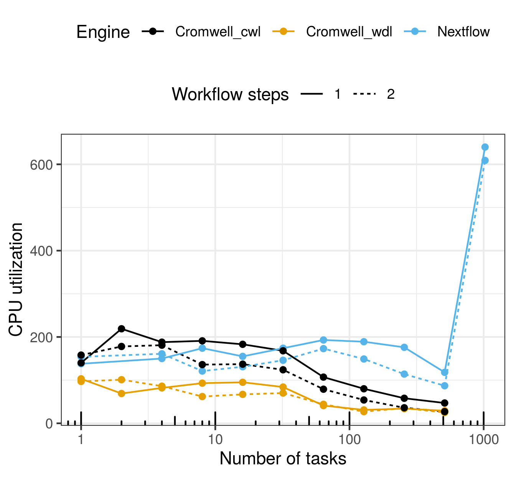
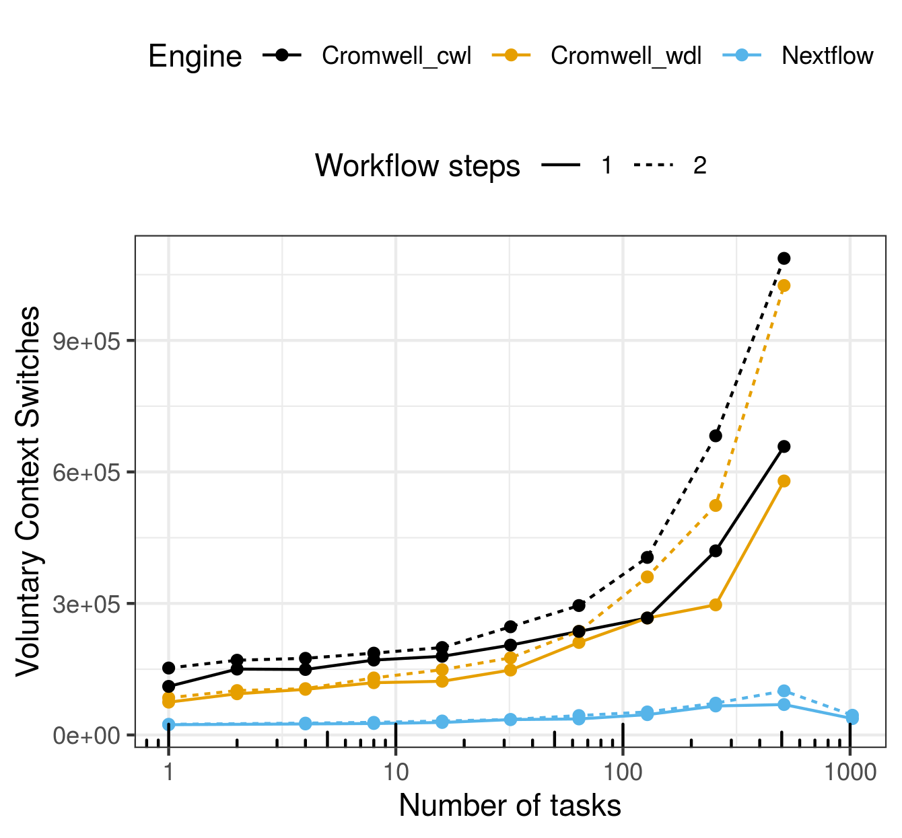

# wfms-scalability

This repo contains the source code, raw results and figures accompanying our manuscript "Requirements-driven design considerations for workflow management systems used in production genomics research and the clinic". Key files in this repo are organized as follows:

```
.
├── cluster.setup.md # Instruction for setting up an AWS slurm cluster 
├── pcluster.config  # AWS Cluster configurations 
├── results.<biocluster/AWS> # Scalability testing results on Biocluster/AWS. Files are organized per Engine+language as:
│   └── <cromwell.wdl/cromwell.cwl/nf> 
│       ├── hosts 
│       │   ├── host1_tasks<1024>.txt # hostnames of running the 1 step workflow of <1024> tasks
│       │   └── host2_tasks<96>.txt   # hostnames of running the 2 step workflow of <96>   tasks
│       ├── logs-wdl
│       │   ├── bioinfoScaling_processes-1_host.txt # Timing and resources of the 1 step workflow
│       │   ├── bioinfoScaling_processes-2_host.txt # Timing and resources of the 2 step workflow
│       │   ├── <jsons/yml> # configuration files for cromwell runs
│       │   └── progress_bioinfoScaling.txt # progress log
│       └── summarize_hosts_nodes.txt # Number of nodes and tasks for the 1 and 2 steps workflow runs
└── src
    ├── analysis # R codes for plotting
    └── <cwl/nf/wdl>
       ├── bioinfoScaling<.cromwell>.sh # Main script for launching tests <via cromwell/toil/..>
       ├── host_process.<cwl/nf/wdl>         # 1 step workflow code
       ├── host_workflow.<cwl/nf/wdl>        # 2 step workflow code
       ├── host_process_workflow.<yml/json>.tmpl  #yml/json inputs template 
       ├── host.<hostname>.tool.cwl   # cwl CommandLineTools files
       ├── host.<hostname>.tool.yml   # inputs for testing cwl tools 
       ├── dag_<cwl_rabix_hosts_workflow>.png  # DAG showing the 2 step workflow
       ├── workflow.options.json      # cromwell options file
       ├── backend.conf               # cromwell backend file
       ├── nextflow.config            # nextflow options file 
       └── cs_scaling_archive         # scripts testing a different scalability definitio
```        


## HPC comparison

The figures shown here are from running those scalability tests on [biocluster](https://biocluster2.igb.illinois.edu/), the HPC cluster of the Carl R. Woese Institute for Genomic Biology at the University of Illinois at Urbana-Champaign. All are from runs (1- or 2- step workflow) with a single CPU core per process, scattered across `n` processes.

Please find the corresponding raw data in the folder [results.biocluster](results.biocluster). Similarly, the data for Figure [xxx]() of the manuscript corresponding to tests done on AWS is available in [results.aws](results.aws). The analysis code to produce these figures is in [src/analysis](src/analysis)







