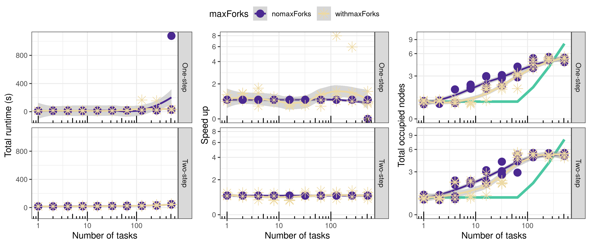

These figures examine the effect of setting the `maxForks`directive in nextflow experiments, as per suggestions on the [pre-print](https://www.biorxiv.org/content/10.1101/2021.04.03.437906v1#comment-5461310331).

Similar to prior experiments, we compare below 5 runs of the nextflow scalabiltiy pipeline when `maxForks` is changed synchronoulsy with `queueSize` (`withmaxForks` in the figures) and when only the `queueSize` argument is changed with `maxForks` left at its default value unchanged (`nomaxForks` in the figures below). The same nextflow version 21.04.1.5556 is used in both sets of experiments, and ran on [biocluster](https://biocluster2.igb.illinois.edu/), the HPC cluster of the Carl R. Woese Institute for Genomic Biology at the University of Illinois at Urbana-Champaign. Namely, we see the pipeline taking alomst the same time in both cases (speed up refers to the ratio between runtime of withmaxForks/nomaxForks). Especially for the 2 step pipeline, we see very similar CPU utilization levels. Involuntary and Voluntary context switches patterns are also highly similar across the board. A 40% vertical jitter is applied to emphasize effects.

  

Execution times, speed up and node uptake

    

    

CPU utilization

    

Involuntary Context Switches

    

Voluntary Context Switches

