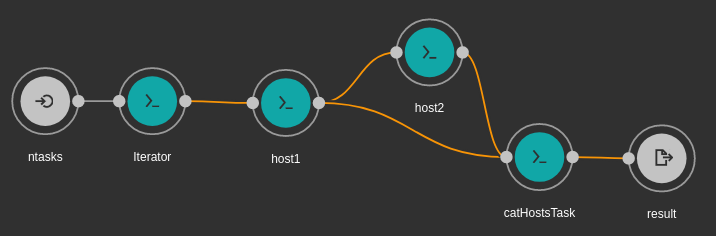

The files in this directory are the scripts and configs needed for testing the scalability of running [CWL]() code via:
1. _Cromwell_: has cluster support (`bioinfoScaling.cromwell.sh`)
2. _Toil_: also has cluster support (only partial code, not tested: `bioinfoScaling.toil.sh`)

As such, the code is written in CWL v1.0
We used a 1- and 2- process workflow scattered across n tasks, where n is increased gradually; at a rate of 1 process/cpu.

<p align="center">
  
</p>

**Fig.** The 2-process workflow DAG (via `rabix` GUI)


## Visualizing the dag:

The DAG of WDL scripts can be visualized vi either the [CWLViewer](https://view.commonwl.org/) app page, or via `rabix` directly 

## Running CWL code:

### Cromwell

The main commands to run via cromwell are below:

```
$ java -jar -Dconfig.file=backend.conf $crom run host_process.cwl -i host.workflow.yml --type cwl #-o workflow.options.json # The "options" flag is not recognized
$
$ java -jar -Dconfig.file=backend.conf $crom run host_workflow.cwl -i host.workflow.yml --type cwl #-o workflow.options.json # The "options flag is not recognized"
```


### Toil
This is not properly checked (self reminder):

```
module load Python/2.7.13-IGB-gcc-4.9.4
export TOIL_SLURM_ARGS="-p normal"
toil-cwl-runner host_process.cwl host.workflow.yml #--batchSystem Slurm --out_dir outputDirectory myjobstore
```


## Acknowledgement

I like to acknowledge [Kaushik Ghose](https://github.com/kaushik-work) from the cWL community for help implementing the scatter trick via [discourse](https://cwl.discourse.group/t/scatter-workflow-step-n-times/71/4)

# Feb 2020
I only need to aggregate toil tests for scalability now!

