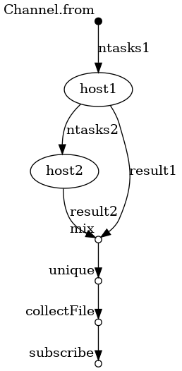

The files in this directory are the scripts and configs needed for testing the scalability of running [Nextflow](https://www.nextflow.io/) code. This is written in `DSL-1`, automated via the script `bioinfoScaling.sh`.

We used a 1- and 2- process workflow scattered across n tasks, where n is increased gradually; at a rate of 1 process/cpu.

<p align="center">
  
</p>

**Fig.** The 2-process workflow DAG (via `nextflow` )


## Visualizing the dag:

The DAG of nextflow scripts can be obtained after an actual run of the pipeline with the `-with-dag` option added as below:

```
$ nextflow run <nexflow script>  -with-dag <dag.png> <other options and flags>
``` 

## Running Nextflow code:

This is as simple as:
```
$ nextflow run host_process.nf -profile cluster --ntasks=<tasks> --forks=<forks> --log=hosts1_tasks<tasks>.txt
$
$ nextflow run host_workflow.nf -profile cluster --ntasks=<tasks> --forks=<forks> --log=hosts1_tasks<tasks>.txt
$ 
```

Notice that I still need to remove the `maxForks` directive from these scripts and replace it with `queueSize` as appropriate

