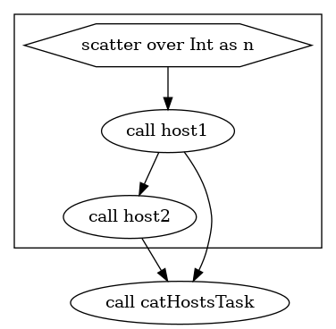
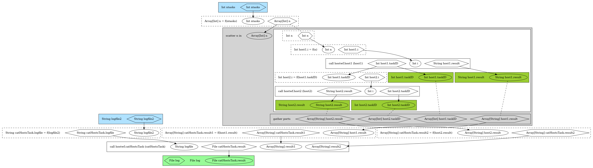

The files in this directory are the scripts and configs needed for testing the scalability of running [WDL](https://github.com/openwdl/wdl) code via 2 runners:
1. _Cromwell_: The de facto runner (`bioinfoScaling.cromwell.sh`)
2. _Toil:_ has alpha support (only partial code, not fully validated: `bioinfoScaling.toil.sh`)

As such, the code is written in WDL `draft-2`

We used a 1- and 2- process workflow scattered across `n` tasks, where `n` is increased gradually; at a rate of 1 process/cpu.

<p align="center">
  
</p>

**Fig.** The 2-process workflow DAG (via `womtool graph`)


<p align="center">
    
</p>


**Fig.** A detailed view of the 2-process workflow DAG (via `womtool womgraph`)


## Visualizing the dag:

The DAG of WDL scripts can be visualized vi either the [Pipeline Builder](http://pb.opensource.epam.com/) app page, or via `Cromwell` as below- assuming (Graphviz library is installed)

```
$ java -jar $wom graph host_workflow.wdl > dag_wdl_hosts_workflow.dot # Use womgraph instead of graph for a detailed DAG
$
$ dot -Tpng dag_wdl_hosts_workflow.dot -o dag_wdl_hosts_workflow.png # Converting to png format
```

## Running WDL code:

### Cromwell

The main commands to run via cromwell are below:

```
$ sed "s/CORES/2/" backend.conf > backend.conf.2 # This sets the rate of new jobs/sec. Remember to check for your backend specifics (eg queue)
$
$ java -jar -Dconfig.file=backend.conf.2 $crom run host_process.wdl -i host_process_workflow.json -o workflow.options.json
$
$ java -jar -Dconfig.file=backend.conf.2 $crom run host_workflow.wdl -i host_process_workflow.json -o workflow.options.json
$
$ rm backend.conf.2 # the file is not really needed anymore and can be deleted!
```


### Toil

While Toil has alpha support for running WDL code, and it has been tested on the workflows in this repo on a stand alone PC; its support for running on clusters/HPCs is limited. A partial bug fix is [here](https://github.com/azzaea/toil.git), and in case one wishes to try, the below command are helpful.

Also note: Toil does not support cascading WDL tasks within a `Scatter` block. Hence, only the 1-process workflow [`host_process.wdl`] in this repo could be run via Toil (on a local PC).

```
$ # Toil installation
$ git clone https://github.com/azzaea/toil.git
$ cd toil
$ #srun --pty /bin/bash # Maybe needed if working on a cluster
$
$ #module load Python/2.7.13-IGB-gcc-4.9.4 # Biocluster-specific
$ python setup.py build
$ export PYTHONPATH=/home/a-m/azzaea/toil/lib/python2.7/site-packages/
$ python setup.py install --prefix=/home/a-m/azzaea/toil

# To actually run a wdl via toil:
$ export TOIL_SLURM_ARGS="-p normal" # slurm queue name
$ cd /home/a-m/azzaea/scalability-tst # location of this repo
$ toil-wdl-runner host_process.wdl host_process_workflow.json --batchSystem Slurm --out_dir outputDirectory myjobstore 
$ #toil-wdl-runner host_workflow.wdl host_process_workflow.json --batchSystem Slurm myjobstore # does not work- cascade within scatter not supported
$
$ #Note that the last 2 steps could have been done manually:
$ # 1. Generate a compiled python script:
$ #toil-wdl-runner --dev_mode 3 <wdl script> <json inputs file>
$ # 2. Run that script to slurm:
$ #python toilwdl_compiled.py --batchSystem Slurm <job store>
$
```


